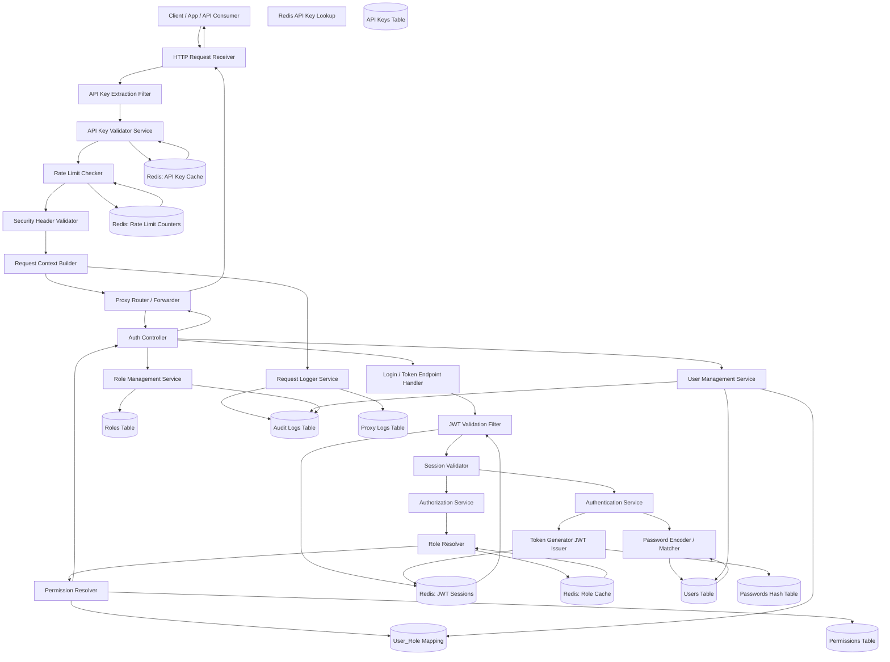

```mermaid
flowchart TD

%% =========================
%% CLIENT
%% =========================
A[Client / App / API Consumer]

%% =========================
%% EDGE LAYER (PROXY)
%% =========================
B1[HTTP Request Receiver]
B2[API Key Extraction Filter]
B3[API Key Validator Service]
B4[Redis API Key Lookup]
B5[Rate Limit Checker]
B6[Security Header Validator]
B7[Request Context Builder]
B8[Request Logger Service]
B9[Proxy Router / Forwarder]

%% =========================
%% IAM ENTRY
%% =========================
C1[Auth Controller]
C2[Login / Token Endpoint Handler]
C3[JWT Validation Filter]
C4[Session Validator]

%% =========================
%% AUTH CORE
%% =========================
C5[Authentication Service]
C6[Password Encoder / Matcher]
C7[Token Generator JWT Issuer]

%% =========================
%% AUTHZ CORE (RBAC)
%% =========================
C8[Authorization Service]
C9[Role Resolver]
C10[Permission Resolver]

%% =========================
%% IAM BUSINESS SERVICES
%% =========================
C11[User Management Service]
C12[Role Management Service]

%% =========================
%% CACHE LAYER (REDIS)
%% =========================
D1[(Redis: API Key Cache)]
D2[(Redis: JWT Sessions)]
D3[(Redis: Role Cache)]
D4[(Redis: Rate Limit Counters)]

%% =========================
%% DATABASE LAYER (MYSQL)
%% =========================
E1[(Users Table)]
E2[(Passwords Hash Table)]
E3[(Roles Table)]
E4[(Permissions Table)]
E5[(User_Role Mapping)]
E6[(API Keys Table)]
E7[(Audit Logs Table)]
E8[(Proxy Logs Table)]

%% =========================
%% FLOW START
%% =========================
A --> B1

%% =========================
%% PROXY PIPELINE (STEP-BY-STEP)
%% =========================
B1 --> B2
B2 --> B3
B3 --> D1
D1 --> B3

B3 --> B5
B5 --> D4
D4 --> B5

B5 --> B6
B6 --> B7
B7 --> B8
B8 --> E8

B7 --> B9

%% =========================
%% IAM ENTRY FLOW
%% =========================
B9 --> C1

C1 --> C2
C2 --> C3
C3 --> D2
D2 --> C3

C3 --> C4

%% =========================
%% AUTH FLOW (LOGIN / VERIFY)
%% =========================
C4 --> C5
C5 --> C6
C6 --> E1
E1 --> C6

C5 --> C7
C7 --> D2
C7 --> E2

%% =========================
%% AUTHZ FLOW (RBAC)
%% =========================
C4 --> C8
C8 --> C9
C9 --> D3
D3 --> C9

C9 --> C10
C10 --> E5
C10 --> E4

%% =========================
%% USER / ADMIN OPS
%% =========================
C1 --> C11
C11 --> E1
C11 --> E5

C1 --> C12
C12 --> E3

%% =========================
%% RESPONSE FLOW BACK
%% =========================
C10 --> C1
C1 --> B9
B9 --> B1
B1 --> A

%% =========================
%% FINAL LOGGING
%% =========================
B8 --> E7
C11 --> E7
C12 --> E7
```
