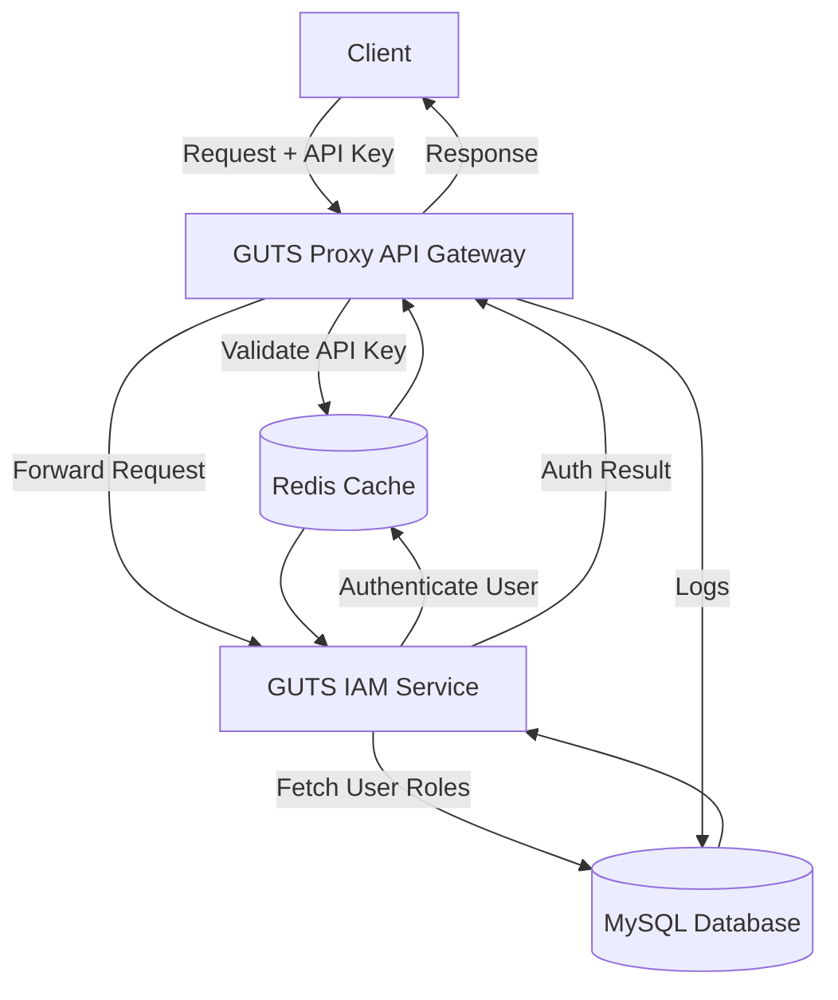

```mermaid
flowchart TD

A[Client]
B[GUTS Proxy API Gateway]
C[GUTS IAM Service]
D[(Redis Cache)]
E[(MySQL Database)]

A -->|Request + API Key| B

B -->|Validate API Key| D
D --> B

B -->|Forward Request| C

C -->|Authenticate User| D
D --> C

C -->|Fetch User Roles| E
E --> C

C -->|Auth Result| B

B -->|Response| A

B -->|Logs| E
```
